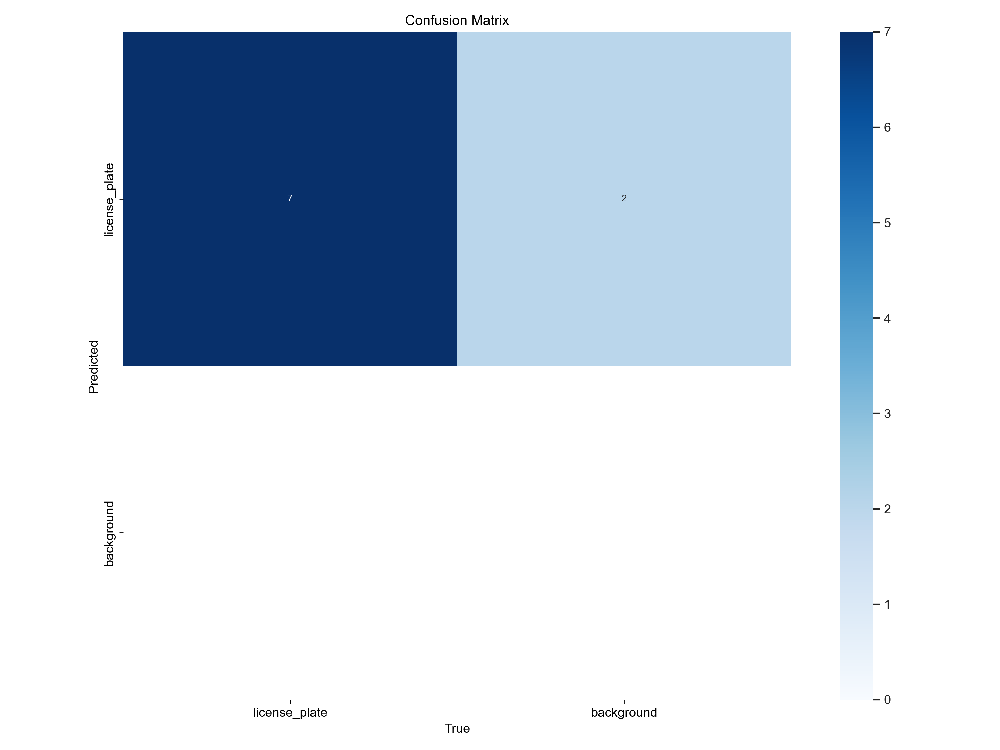
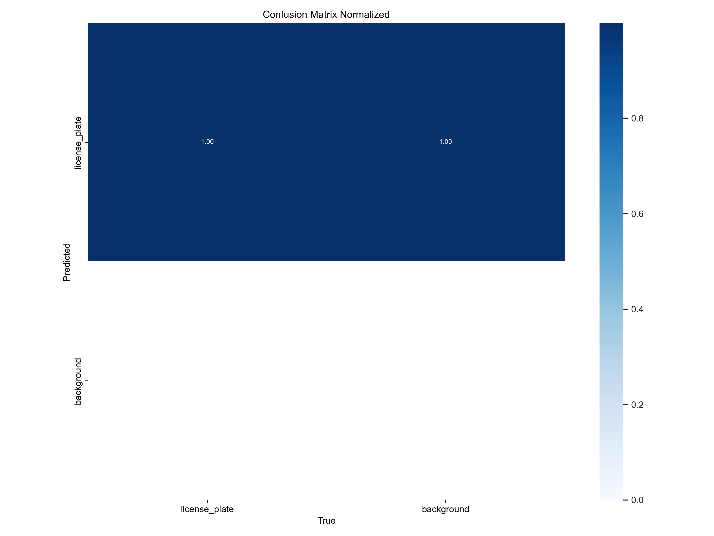
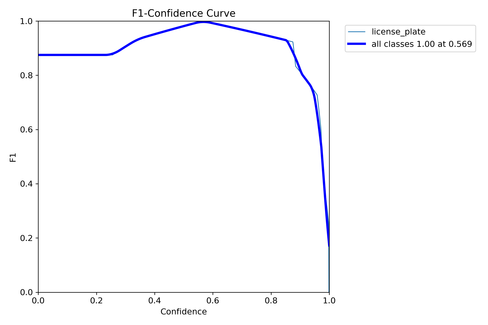
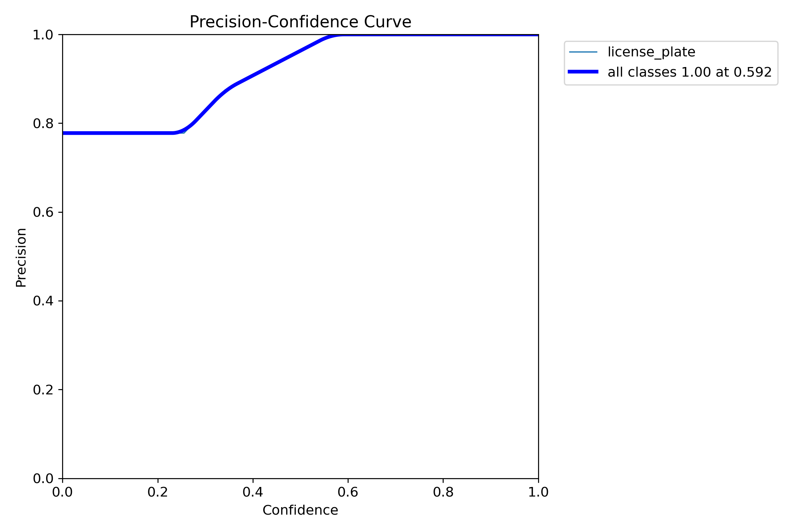
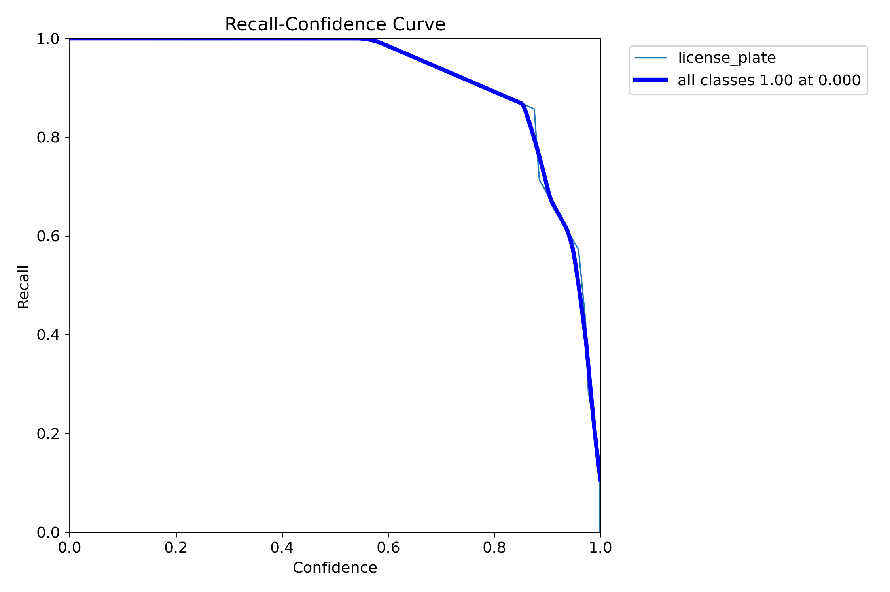
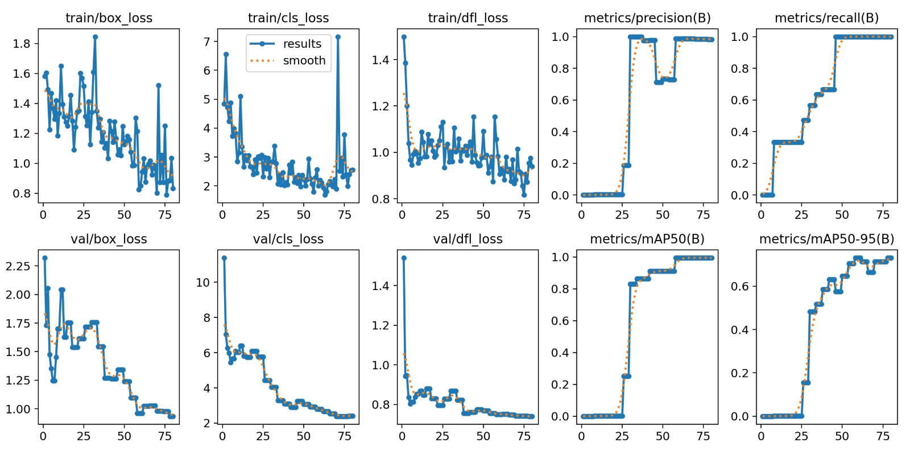
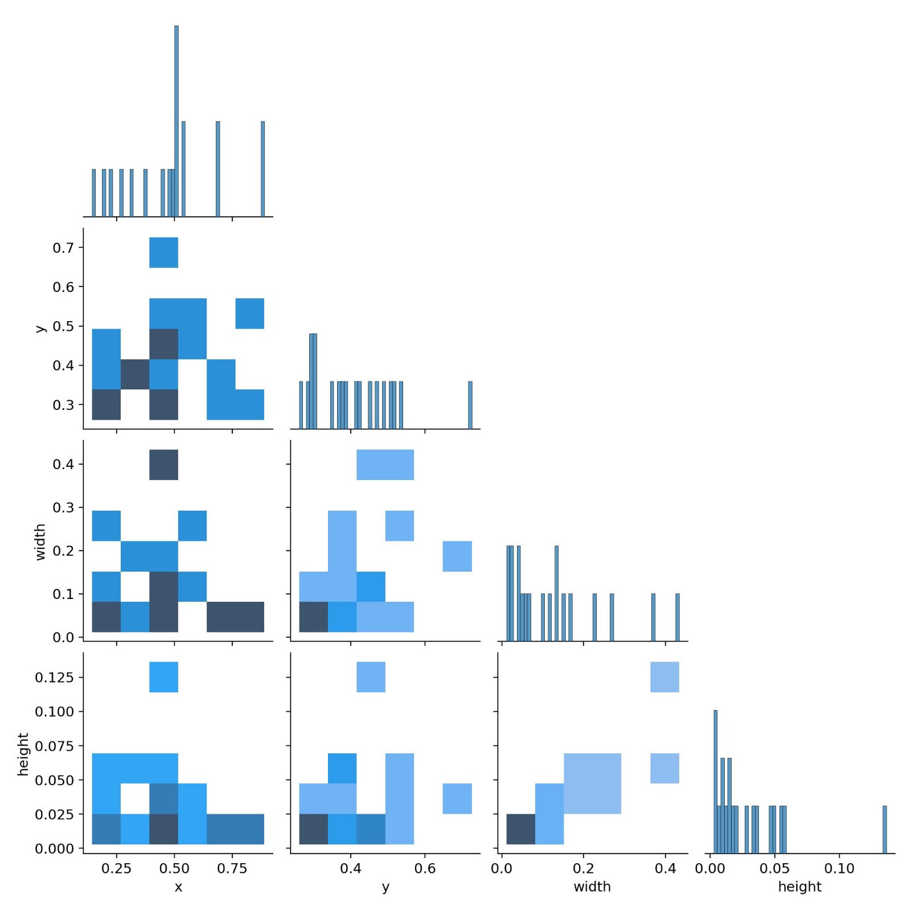

<!-- @import "design/style.css" -->
Autores: Francesco Faustino Greco - Bianca Cocci  
**GRUPO 05**

# VISIÓN POR COMPUTADOR - PRÁCTICA 4 & 4b

## Índice

- [Introducción](#introducción)
- [Graficas Del Reentreamiento](#graficas-del-reentreamiento)
- [Detección de vehículos](#detección-de-vehículos)
- [Reconocimiento de matrículas](#reconocimiento-de-matrículas)
- [Resultados y análisis](#resultados-y-análisis)
- [Fuentes y Documentación](#fuentes-y-documentación)

---

## Introducción

El objetivo de esta práctica es **diseñar un sistema automático para la detección de vehículos y el reconocimiento de matrículas** en video.  
Para lograrlo, se emplean dos componentes principales:

- **YOLOv11n**: modelo de detección rápida de objetos (vehículos y matrículas).  
- **EasyOCR**: herramienta de reconocimiento óptico de caracteres (OCR) para extraer el texto de las matrículas.

El flujo completo del sistema combina técnicas de **visión por computador**, **detección de objetos** y **reconocimiento de texto**, integrando todo en un pipeline funcional que genera un **video anotado** y un **archivo CSV** con los resultados.

<p align="center">
  
</p>

---

## Graficas Del Reentreamiento
Aquí hay una tabla que muestra los gráficos de Reentreamiento: 
<table style="width: 100%; text-align: center; border-spacing: 20px;">
  <tr>
    <td style="text-align: center;">
      
      <p>Esta es la matriz de confusión que muestra cómo el modelo predice cada clase.</p>
    </td>
    <td style="text-align: center;">
      
      <p>Esta matriz normalizada refleja el nivel de precisión relativa de cada clase.</p>
    </td>
  </tr>

  <tr>
    <td style="text-align: center;">
      
      <p>La curva F1 ilustra el equilibrio entre precisión y recall según la confianza del modelo.</p>
    </td>
    <td style="text-align: center;">
      
      <p>Curva que muestra cómo varía la precisión del modelo a diferentes niveles de confianza.</p>
    </td>
  </tr>

  <tr>
    <td style="text-align: center;">
      
      <p>La curva precisión-recall permite visualizar el rendimiento global del modelo.</p>
    </td>
    <td style="text-align: center;">
      
      <p>La curva de recall muestra la capacidad del modelo para detectar correctamente los casos relevantes.</p>
    </td>
  </tr>
    <tr>
    <td style="text-align: center;">
      
      <p>El gráfico muestra los resultados de tu entrenamiento con sus respectivas predicciones y comparaciones.</p>
    </td>
    <td style="text-align: center;">
      
      <p>La gráfica muestra la distribución y relación entre las variables del modelo mediante histogramas y mapas de calor.</p>    
    </td>
  </tr>
</table>


---

## Detección de vehículos

En esta etapa, se configura el entorno de trabajo y se carga el modelo **YOLOv11n** previamente entrenado para identificar tanto **vehículos** como **matrículas**.  

Se definen las rutas de entrada y salida, asegurando la estructura de carpetas necesaria:

```python
from pathlib import Path
#define 3 folders
BASE = Path(".").resolve()
DATA = BASE / "data"  # input video and dataset
MODELS = BASE / "models"  # for the trained YOLO model
OUT = BASE / "outputs"  # where to store the result

OUT.mkdir(exist_ok=True, parents=True)
MODELS.mkdir(exist_ok=True, parents=True)

VIDEO_IN  = DATA / "input.mp4"
VIDEO_OUT = OUT / "video_annotato.mp4"
CSV_OUT   = OUT / "log_rilevaciones.csv"
```

Posteriormente, se verifica la disponibilidad del video y se carga el modelo:

```python
from ultralytics import YOLO
import cv2

# Cargar modelo YOLO
model = YOLO("models/best.pt")

# Verificar video de entrada
cap = cv2.VideoCapture(str(VIDEO_IN))
if not cap.isOpened():
    print("Error: no se puede abrir el video de entrada.")
```

Durante el procesamiento, YOLO detecta vehículos y matrículas cuadro por cuadro, devolviendo sus coordenadas y etiquetas.
```python
results = model(frame)
for r in results:
    boxes = r.boxes.xyxy
    classes = r.boxes.cls
    conf = r.boxes.conf
```
Cada detección se representa gráficamente sobre el video, y se almacena la información en un registro CSV.

---

## Reconocimiento de matrículas
Una vez detectadas las matrículas en cada frame, se extraen las regiones de interés (ROI) y se aplica EasyOCR para leer el texto.

```python
import easyocr
reader = easyocr.Reader(['en'])

for box in license_boxes:
    x1, y1, x2, y2 = map(int, box)
    roi = frame[y1:y2, x1:x2]
    result = reader.readtext(roi)
    if result:
        text = result[0][-2]
        print("Matrícula detectada:", text)
```
EasyOCR devuelve una lista con el texto detectado y su nivel de confianza.
El texto reconocido se superpone sobre el video, junto con el rectángulo que marca la matrícula detectada. 
Además, el sistema guarda automáticamente cada evento (vehículo detectado, texto leído, frame y coordenadas) en un archivo CSV para análisis posterior:
```python
import csv
with open(CSV_OUT, "a", newline="") as f:
    writer = csv.writer(f)
    writer.writerow([frame_id, label, text, conf, x1, y1, x2, y2])
```

---

## Resultados y análisis

El sistema produce como salida:

1. Un **video anotado (`video_annotato.mp4`)** que muestra, en tiempo real, las detecciones de vehículos y las matrículas reconocidas.  
2. Un **archivo CSV (`log_rilevaciones.csv`)** con información estructurada de cada detección.

El rendimiento del sistema depende de:
- La **iluminación** y **resolución** del video de entrada.  
- La **precisión del modelo YOLO** utilizado.  
- La **claridad y orientación** de las matrículas.

El sistema ha demostrado resultados robustos en entornos controlados, aunque puede verse afectado por condiciones adversas (luces intensas, reflejos o matrículas parcialmente ocultas).


<p align="center">
  <b>Video número 1: salida con detección</b><br>
  
</p>

<p align="center">
  <b>Video número 2: video asignado como tarea</b><br>
  
</p>

<p align="center">
  <b>Detección con modelo de personas y seguimiento en movimiento</b><br>
  
</p>

### `test_lp_eval.csv`

Este archivo contiene los resultados de evaluación del modelo de detección de matrículas (license plates) en el conjunto de prueba (`test`).

Cada fila representa una predicción del modelo comparada con su etiqueta real, permitiendo analizar el rendimiento de detección y reconocimiento.  

**Columnas (en orden):**
- **file**: nombre del archivo de imagen (por ejemplo, `3824JLB.jpg`).  
- **gt_text**: texto *ground truth* de la matrícula (valor correcto).  
- **ocr_text**: texto reconocido por el modelo OCR.  
- **gt_bbox**: *bounding box* real en el formato `[xmin, ymin, xmax, ymax]`.  
- **pred_bbox**: *bounding box* predicha por el modelo en el mismo formato.  
- **IoU**: valor de *Intersection over Union* entre `gt_bbox` y `pred_bbox`, tal como se muestra en el archivo (puede expresarse como fracción o porcentaje dependiendo del proceso de cálculo utilizado).

---

## Fuentes y Documentación

- [Documentación oficial de OpenCV](https://docs.opencv.org/)  
- **ChatGPT** – Asistencia para redacción técnica y explicación de código
- **Google Translate** – Asistencia lingüística
