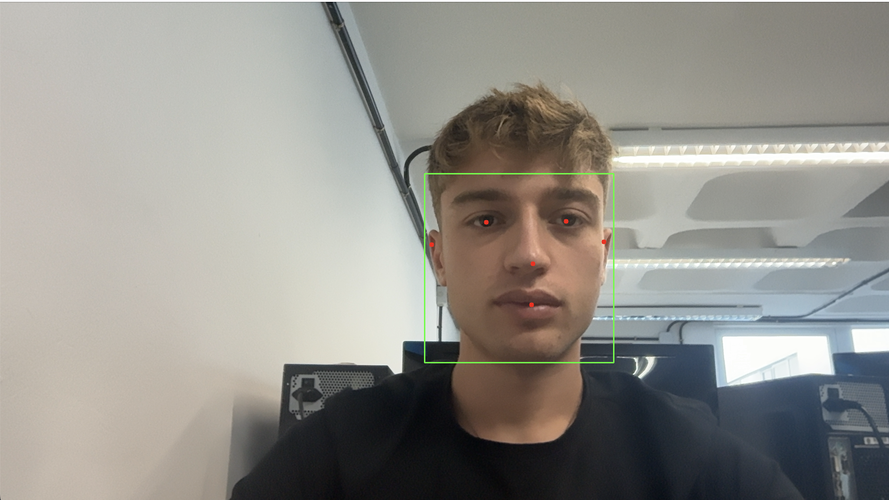

<!-- @import "design/style.css" -->
Autores: Francesco Faustino Greco – Bianca Cocci  
**GRUPO 05**

# VISIÓN POR COMPUTADOR – PRÁCTICA 5

## Índice

- [Introducción](#introducción)
- [Reentrenamiento y elección del modelo](#reentrenamiento-y-elección-del-modelo)
- [Captura y generación del dataset](#captura-y-generacion-del-dataset)
- [Detección de rostros (MediaPipe Face Detection)](#detección-de-rostros-mediapipe-face-detection)
- [Filtro tipo Snapchat con Face Mesh](#filtro-tipo-snapchat-con-face-mesh)
- [Resultados y análisis](#resultados-y-análisis)
- [Fuentes y Documentación](#fuentes-y-documentación)

---

## Introducción

En esta práctica se desarrollaron **dos sistemas de visión** basados en *MediaPipe* y *OpenCV*:

1. **Detección de rostros** usando MediaPipe Face Detection.  
2. **Filtro tipo Snapchat**, utilizando MediaPipe Face Mesh para colocar elementos digitales sobre la cara (orejas de perro, orejas dálmata, nariz, lengua, etc.).

Ambos trabajos cumplen con la temática solicitada:  
- El primero reproduce un problema clásico de detección.  
- El segundo es completamente libre y recrea filtros faciales interactivos.

---

## Captura y generación del dataset

Para complementar los módulos de detección y filtros, se creó un pequeño **dataset propio** utilizando el cuaderno `cattura_dataset.ipynb`.  
Este archivo permite capturar imágenes desde la webcam y organizarlas automáticamente en carpetas etiquetadas.

### Funcionalidades principales

Definición de la clase a capturar mediante:
```python
  CLASS_NAME = "smile"  # Ejemplo de clase
```
- Creación automática de la carpeta correspondiente dentro de dataset/.
- Captura de imágenes con barra espaciadora.
- Visualización en tiempo real con OpenCV.
- Almacenamiento estructurado de los datos para uso posterior en modelos de clasificación.

https://github.com/user-attachments/assets/79795a53-f069-4de4-bbfe-97a8d0334c06

---

## Reentrenamiento y elección del modelo MediaPipe

Se evaluaron distintas opciones estudiadas en clase (Haar Cascades, HOG, DNN). Finalmente se seleccionó **MediaPipe**, ya que ofrece:

- Modelos ligeros y optimizados para tiempo real.  
- Detección estable incluso en condiciones de iluminación imperfecta.  
- Keypoints automáticos para cada rostro.  
- Fácil integración con Python y OpenCV.


---

## Detección de rostros (MediaPipe Face Detection)

El primer módulo detecta rostros en tiempo real mediante:

- `model_selection=0` → mejor para distancias cortas (webcam).  
- Dibujado automático de bounding boxes y keypoints.  
- Procesamiento en RGB para compatibilidad con MediaPipe.

<p align="center">
  <b>Órdenes para cambiar al perro</b><br>
  
</p>

### Código principal

```python
import cv2
import mediapipe as mp

mp_face_detection = mp.solutions.face_detection
face_detection = mp_face_detection.FaceDetection(model_selection=0, min_detection_confidence=0.5)
mp_drawing = mp.solutions.drawing_utils

cap = cv2.VideoCapture(0)

while True:
    ret, frame = cap.read()
    if not ret:
        break

    results = face_detection.process(cv2.cvtColor(frame, cv2.COLOR_BGR2RGB))

    if results.detections:
        for detection in results.detections:
            mp_drawing.draw_detection(frame, detection)

    cv2.imshow("MediaPipe Face Detection", frame)
    if cv2.waitKey(1) & 0xFF == ord("q"):
        break

cap.release()
cv2.destroyAllWindows()
```

---

## Filtro tipo Snapchat con Face Mesh  
En el segundo módulo se implementó un filtro interactivo inspirado en Snapchat:  
MediaPipe Face Mesh detecta 468 puntos faciales.  
Se superponen PNG con canal alfa:  
- Orejas de perro  
- Orejas dálmata  
- Nariz  
- Lengua  

Con las teclas:  
"1" → modo perro  
"2" → modo dálmata  

<p align="center">
  <b>Órdenes para cambiar al perro</b><br>
  
</p>


### Funcionalidades principales  
- Cálculo de posiciones relativas de puntos clave.  
- Escalado automático de los PNG.  
- Función overlay_image() para mezclar imágenes con transparencia.  
- Renderizado en tiempo real.  

---

## Resultados y análisis
Face Detection funciona de forma muy estable incluso con varios rostros.
- El modelo reconoce correctamente ojos, nariz, boca y mejillas.
- El filtro estilo Snapchat se ajusta bien a la posición del rostro gracias a los 468 puntos que proporciona Face Mesh.
- El rendimiento es fluido en tiempo real (≈30 FPS).
- El cambio de filtro mediante teclado permite una interacción rápida.


https://github.com/user-attachments/assets/aadf0012-a7e6-4e99-9a53-6e1884c073f3


---

## Fuentes y Documentación

- [Documentación oficial de OpenCV](https://docs.opencv.org/)  
- **ChatGPT** – Asistencia para redacción técnica y explicación de código
- **Google Translate** – Asistencia lingüística


